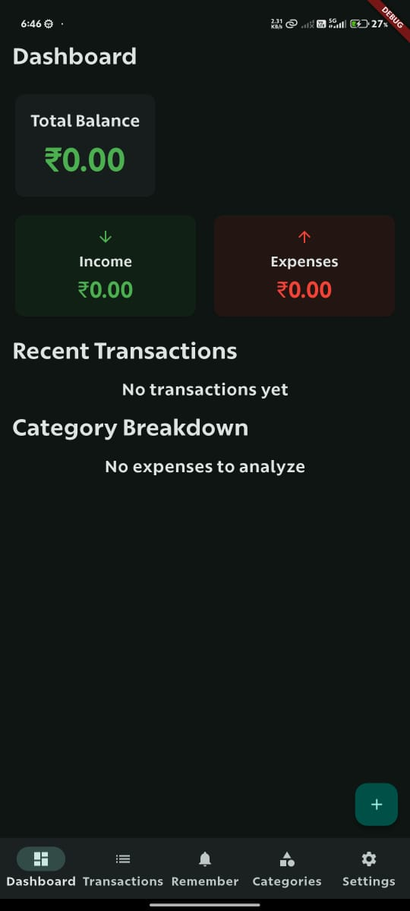
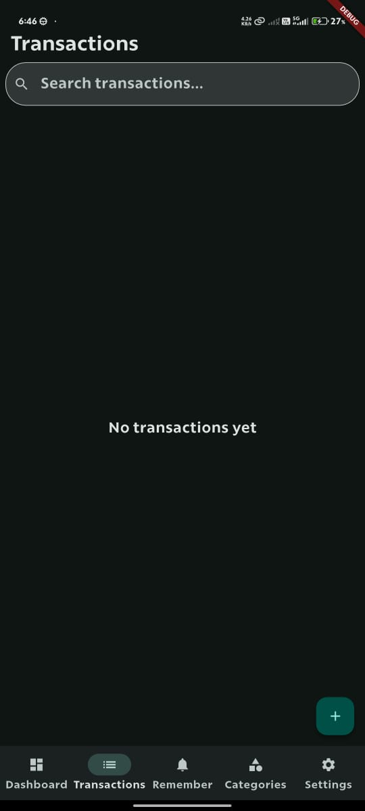
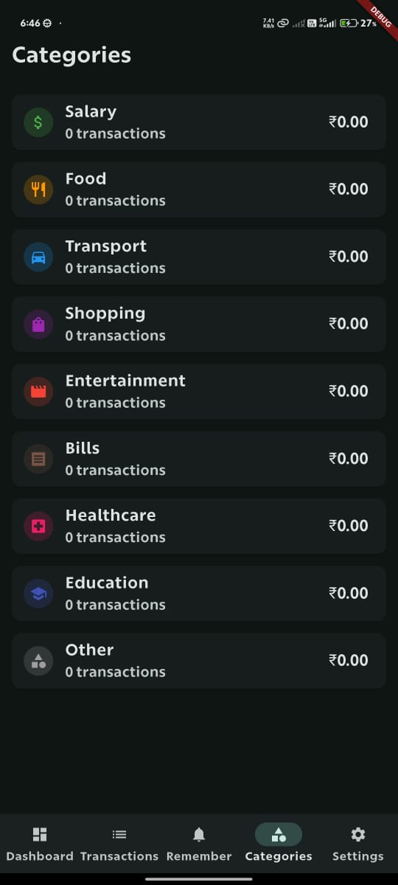
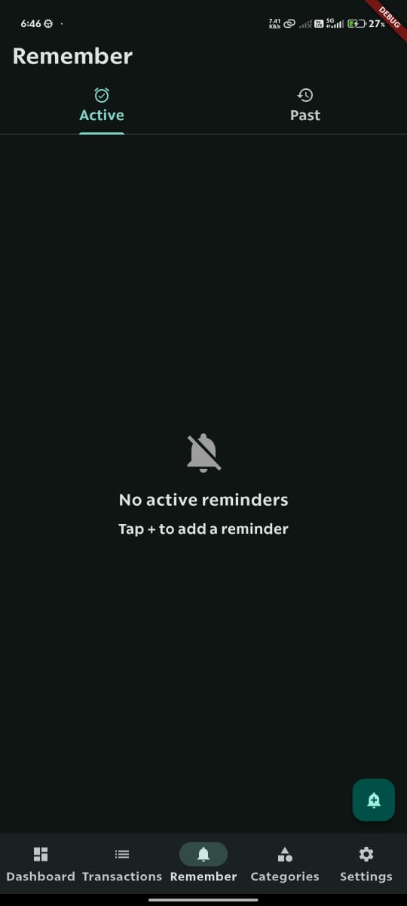
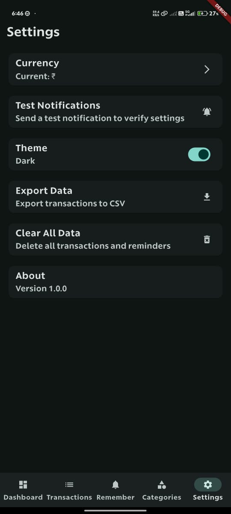

# ExTrack - Expense Tracker

ExTrack is a comprehensive Flutter application for tracking personal finances, managing expenses, and setting financial reminders. The app provides a clean, intuitive interface for users to monitor their financial health and maintain control over their spending habits.

## Features

- **Dashboard**: 
  - View your financial overview with income, expenses, and balance
  - Track recent transactions at a glance
  - Monitor upcoming reminders and financial events
  - Visualize spending patterns with category breakdowns

- **Transaction Management**: 
  - Add, edit, and delete income and expense transactions
  - Categorize transactions for better organization
  - Add notes and details to transactions
  - Filter and search transactions by various criteria

- **Categories**: 
  - Organize transactions using predefined categories
  - Visual representation with icons and colors
  - Category-based analytics and insights

- **Reminders**: 
  - Set notifications for bills, subscriptions, and other financial events
  - Receive alerts even when the app is closed
  - Mark reminders as complete or reschedule them
  - Different reminder types (bill payments, salary reminders, budget reviews, etc.)

- **Analytics**: 
  - Visualize spending patterns with category breakdowns
  - Track income vs. expenses over time
  - Identify spending trends and areas for potential savings

- **Settings**:
  - Customize currency symbol
  - Test notification functionality
  - Export data (coming soon)
  - Theme preferences (light/dark mode)

## Screenshots

| Dashboard | Transactions | Categories |
|:---------:|:------------:|:----------:|
|  |  |  |

| Reminders | Settings |
|:---------:|:--------:|
|  |  |

## Installation

### Prerequisites
- Flutter SDK (version 3.8.1 or higher)
- Dart SDK (version 3.0.0 or higher)
- Android Studio / VS Code with Flutter extensions
- For iOS development: Xcode (on macOS)
- For Android development: Android SDK

### Setup
1. Clone the repository
   ```
   git clone https://github.com/enclave-projects/extrack.git
   ```
2. Navigate to the project directory
   ```
   cd extrack
   ```
3. Install dependencies
   ```
   flutter pub get
   ```
4. Run the app
   ```
   flutter run
   ```

## Building for Different Platforms

### Android
```
flutter build apk --release
```

### iOS
```
flutter build ios --release
```

### Windows
```
flutter build windows --release
```

*This application is more compatible with Android, not with the iOS, macOS or Windows*

## Technologies Used

- **Flutter**: UI framework for cross-platform development
- **Shared Preferences**: Local data storage for user settings and transaction data
- **Flutter Local Notifications**: For scheduling and managing reminder notifications
- **Timezone**: For handling scheduled notifications across different time zones
- **Intl**: For date and number formatting with localization support

## Implementation Details

### Data Storage
The app uses SharedPreferences for storing transaction and reminder data locally on the device. Data is serialized to JSON format for storage and deserialized when retrieved.

### Notification System
ExTrack implements a robust notification system using Flutter Local Notifications plugin:
- Scheduled notifications for reminders
- Proper timezone handling for accurate timing
- Background notification delivery when the app is closed
- Notification permissions handling for Android and iOS

### UI/UX Design
- Material Design 3 implementation
- Responsive layouts that work across different screen sizes
- Intuitive navigation with bottom navigation bar
- Modal bottom sheets for data entry
- Card-based UI for clear information hierarchy

## Project Structure

- `lib/main.dart`: Main application entry point containing all the UI components and business logic
- `assets/`: Contains images, icons, and other static resources
- `android/`, `ios/`, `windows/`: Platform-specific code and configurations

## Permissions

The app requires the following permissions:
- **Notification Permissions**: To display reminder notifications
- **Exact Alarm Permissions** (Android): To schedule precise notification timing
- **Boot Completed** (Android): To restore scheduled notifications after device restart

## Future Enhancements

- Cloud synchronization across devices
- Data backup and restore functionality
- Budget planning and tracking
- Financial goals setting and monitoring
- Reports and exports in various formats
- Multiple currency support
- Recurring transaction templates

## Contributing

Contributions are welcome! Please feel free to submit a Pull Request.

1. Fork the repository
2. Create your feature branch (`git checkout -b feature/amazing-feature`)
3. Commit your changes (`git commit -m 'Add some amazing feature'`)
4. Push to the branch (`git push origin feature/amazing-feature`)
5. Open a Pull Request

## License

This project is licensed under the MIT License - see the LICENSE file for details.

## Acknowledgements

- Flutter team for the amazing framework
- All contributors who have helped with the project
- The open-source community for various libraries and tools used in this project
